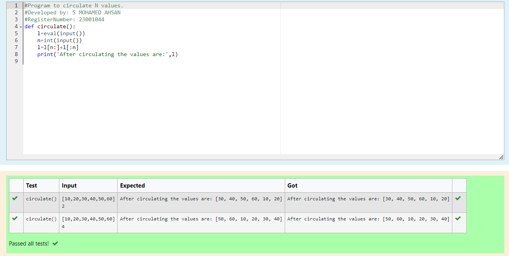

# Circulate-the-values-of-N-variables
## Aim:
To write a python program to circulate the n variables using function concept

## Equipment’s required:
PC
Anaconda - Python 3.7

## Algorithm: 
### Step 1: 
Define a function circulate()
### Step 2:
Get an list from the user using input() function
### Step 3: 
Get the value from the user for the number of rotation
### Step 4: 
Using the slicing concept rotate the list
### Step 5:
Print the list after slicing 
### Step 6: 
Call the function circulate() and verify the output
## Program:
~~~
#Program to circulate N values.
#Developed by: MOHAMEDAHSAN
#RegisterNumber: 23001044

def circulate():
    l=eval(input())
    n=int(input())
    l=l[n:]+l[:n]
    print('After circulating the values are:',l)
~~~

## Output:

## Result:
A python program to circulate the n variables using function concept was successfully created and tested.